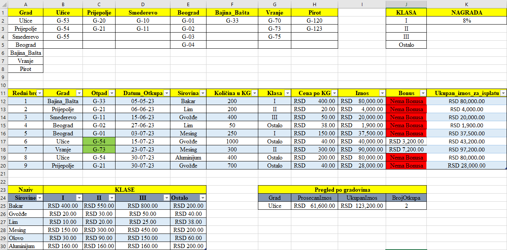

# Scrap Metal Procurement & Rewards Tracker

## Description
This Excel project is a data tracking system designed to manage and calculate scrap metal purchases across multiple recycling yards and cities. The system utilizes advanced data validation techniques to prevent entry errors, automates complex pricing matrices based on material categories and quality classes, and applies conditional logic for financial bonus rewards.

## Features
* **Dependent Data Validation (INDIRECT Function):** The `Otpad` (Recycling Yard) column uses dynamic data validation linked indirectly to the `Grad` (City) column. For example, selecting "Bajina Bašta" restricts the user to choosing only the recycling yards available within that specific area.
* **Standard Data Validation:** Applied to the `Sirovina` (Material) and `Klasa` (Class) columns to ensure clean, standardized data entry via drop-down menus.
* **Matrix Pricing Lookup (VLOOKUP + MATCH):** Automatically routes and determines the price per kilogram (`Cena po KG`) based on two variables. It dynamically pulls data from a reference matrix depending on the selected material type and quality class.
* **Advanced Conditional Bonus Logic:** Uses a nested logic formula `IF(OR(..., AND(...)))` to check multiple criteria (based on weight and pricing thresholds). If the conditions are met, it dynamically calculates a financial reward; otherwise, it safely defaults to "Nema Bonusa".
* **Clean Layout & Visual Signals:** Features proper alignment for financial numbers (RSD), data filtering on main tables, and conditional formatting (Red highlights for non-bonus entries and green highlights for active metrics).

## Technologies Used
* Microsoft Excel (`.xlsx`)
* Advanced Validation Techniques (`INDIRECT` and Data Validation Lists)
* Dynamic Routing Formulas (`VLOOKUP` combined with `MATCH`)
* Complex Conditional Logic (`IF`, `OR`, `AND` functions)

## Preview

